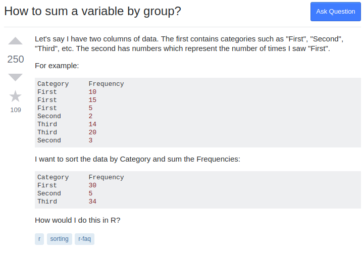
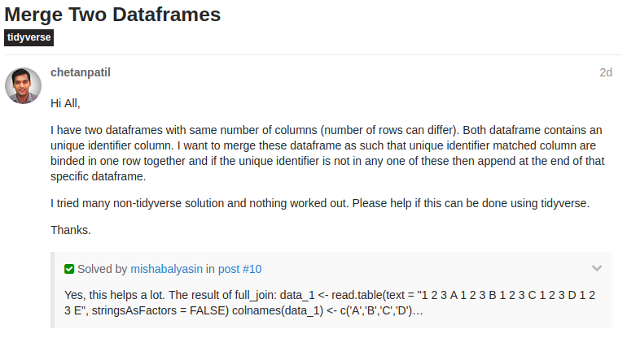
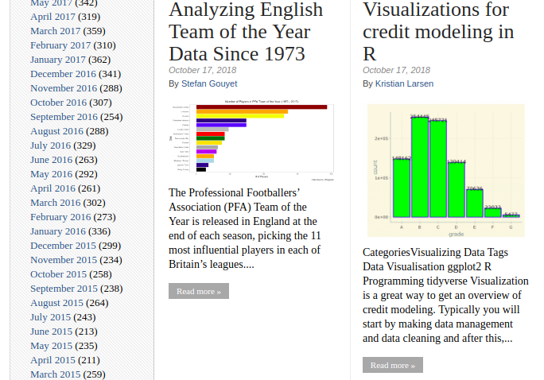
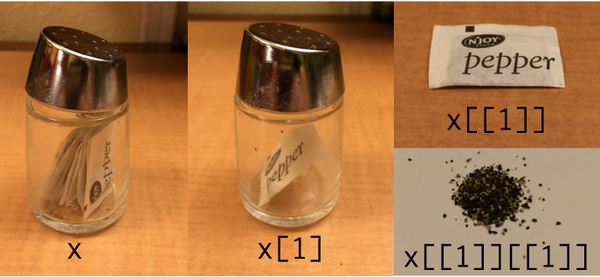
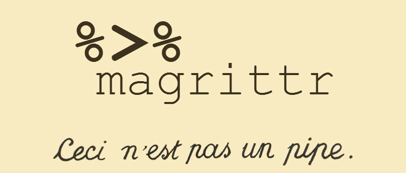

```{r setup, include=FALSE}
knitr::opts_chunk$set(echo = FALSE)

require(tidyverse)
```

## Minervo

**Innovative and meaningfull approach to informal education.** 

- Interactive and practical workshops
- Social impact
- Networking
- Afordable
- Nice and inspiring environment


## About the tutor

Experience:

- Data scientist at Quichesoft - fuel price optimization
- Data scientist at RTSmunity - esport betting
- Credit risk analyst at Ernst & Young
- Financial analyst at Raiffeisenbank

Hobbies:

- Sport - american football, tenis
- Education - machine learning, AI

Me & R:

- 6 years of experience - statistical modelling, vizualization, data analysis
- 2 years full-time - programming, package development


## About You

<br>

**>> Who are you and what do you work on?**

**>> Where and why do you use R nowadays?**

**>> What do you expect from today's workshop?**


## Goals of this workshop

1. Understand the basics of R language
2. Be able to perform simple manipulation of a data frame
3. Vizualize your data and communicate results


## Agenda

**Block I 90 minutes**

- Introduction into R & RStudio
- Sources for learning and/or help
- Syntax and data strctures
- Basic data imports (RData, csv)
- Functional programming (purrr)


**Break 30 minutes**

- Refreshments & Networking

**Block II 90 minutes**

- Basic data manipulation (dplyr)
- Basic vizualization (ggplot2)


## You will learn...

- The **tidyverse** approach to R
- How to use RStudio efficiently
- How to load and manipulate data
- How to visualize your data
- How to run statistical and machine learning models
- How to automate your daily tasks in simple scripts
- How to generate reports and analyses w/o any effort

*... not today but throughout all three parts.*


## You will NOT learn...

- The **base** approach to R (ugly and boring)
- General programming in R
- Package development
- Efficient sharing work with your team
- Math behind statistical and machine learning models

*All these topics (except base R) will be covered in other workshops*

## Base R

```{r echo=TRUE}
data <- data.frame(x = 1:5)
data$y <- data$x^2
plot(data$x, data$y)
```

## Tidyverse

```{r echo=TRUE}
data_frame(x = 1:5, y = x^2) %>% 
  ggplot(aes(x, y)) + geom_point()
```


# Where to find help

## StackOverflow




## RStudio Community



## Google

<div align="center">

</div>

## R-bloggers



## Twitter #rstats

<div class="columns-2">

**Hadley Wickham**<br>
Chief Scientist at RStudio<br>
<a href="https://twitter.com/hadleywickham">@hadleywickham</a>
<br><br>

**Jenny Bryan**<br>
Proffesor at UBC, DS at RStudio<br>
<a href="https://twitter.com/jennybryan">@JennyBryan</a>
<br><br>

**Mara Averick**<br>
Inspirations for visualization<br>
<a href="https://twitter.com/dataandme">@dataandme</a>
<br><br>

**David Robinson**<br>
Chief Data Scientist at DataCamp<br>
<a href="https://twitter.com/drob">@drob</a>
<br><br>

</div>


## Time to start

- Make sure you have R & RStudio installed. Problems? Ask for help
- Open RStudio
- Create new project: **File > New Project... > New directory > New project**
- Always create new project before doing something

<br>

```{r eval=FALSE, echo=TRUE}
install.packages(c("tidyverse", "repurrrsive"))
```


# Console scripting

## Vectors

Atomic:

- `logical`
- `integer`
- `numeric`
- `character`

Other:

- `list`

## Lists

<div align="center">


*by Hadley Wickham*
</div>


## Working directory

- Do NOT use it
- Do NOT change it
- Do NOT touch it
- Do NOT even think of it

- Use projects instead

*... we will cover this in workshop **R for teams**.*


# RStudio look-around

# Loading data

## `dplyr` functions

- `select()` select columns
- `filter()` filter rows
- `arrange()`	re-order or arrange rows
- `mutate()` create new columns
- `summarise()`	summarise values
- `group_by()` allows for group operations in the “split-apply-combine” concept

# Functional Programming

## Function arguments

When calling a function we pass variables as:

- Named arguments
- Unnamed arguments

Arguments inside the function are named. How to decide which variable is for which argument.

1. All named arguments are assigned by name.
2. Unnamed arguments are assigned by order.
3. Unassigned arguments will use default value, if it exists.

Somethimes, we pass more arguments than the function is ready for -> elipsis (`...`).
Elipsis is something that the function passes into another function.
Not all functions have elipsis, though.


```{r, eval=FALSE, echo=TRUE}
foo <- function(a, b, c, d = NA, ..., z = NA) {}
foo(c = 1, 2, e = 3, 4, a = 5, 6)
```

## Pipes

<div align="center">

</div>

# Data manipulation

# Grammar of Graphics
