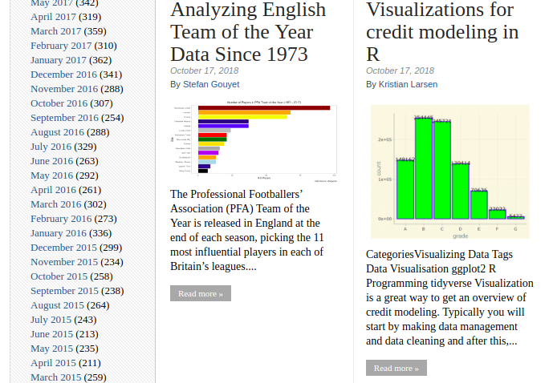
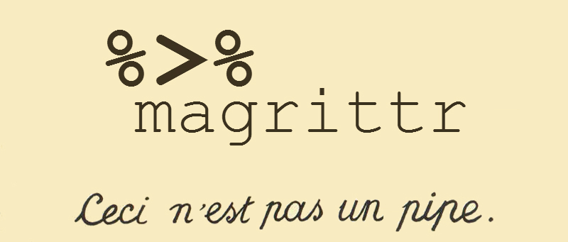

```{r setup, include=FALSE}
knitr::opts_chunk$set(echo = FALSE)

require(tidyverse)
```

## Minervo

**Innovative and meaningfull approach to informal education.** 

- Interactive and practical workshops
- Social impact
- Networking
- Afordable
- Nice and inspiring environment


## About the tutor

Experience:

- Data scientist at Quichesoft - fuel price optimization
- Data scientist at RTSmunity - esport betting
- Credit risk analyst at Ernst & Young
- Financial analyst at Raiffeisenbank

Hobbies:

- Sport - american football, tenis
- Education - machine learning, AI

Me & R:

- 6 years of experience - statistical modelling, vizualization, data analysis
- 2 years full-time - programming, package development


## About You

<br>

**>> Who are you and what do you work on?**

**>> Where and why do you use R nowadays?**

**>> What do you expect from today's workshop?**


## Goals of this workshop

1. Understand the basics of R language
2. Be able to perform simple manipulation of a data frame
3. Vizualize your data and communicate results


## You will learn...

- The **tidyverse** approach to R
- How to use RStudio efficiently
- How to load and manipulate data
- How to visualize your data
- How to run statistical and machine learning models
- How to automate your daily tasks in simple scripts
- How to generate reports and analyses w/o any effort

*... not today but throughout all three parts.*


## You will NOT learn...

- The **base** approach to R (ugly and boring)
- General programming in R
- Package development
- Efficient sharing work with your team
- Math behind statistical and machine learning models

*All these topics (except base R) will be covered in other workshops*

## Base R

```{r echo=TRUE}
data <- data.frame(x = 1:5)
data$y <- data$x^2
plot(data$x, data$y)
```

## Tidyverse

```{r echo=TRUE}
data_frame(x = 1:5, y = x^2) %>% 
  ggplot(aes(x, y)) + geom_point()
```


## Please give us a feedback

<br>
<div align="center">

</div>


## Agenda - Part 1

**Block I 90 minutes**

- Introduction into R & RStudio
- Sources for learning and/or help
- Syntax and data structures
- Basic data imports (RData, csv, Excel)


**Break 30 minutes**

- Refreshments & Networking

**Block II 90 minutes**

- Basic data manipulation (dplyr)
- Basic vizualization (ggplot2)


# Where to find help

## RStudio cheat sheets

<div align="center">

</div>


## StackOverflow


## RStudio Community


## Google

<div align="center">

</div>

## R-bloggers



## Twitter #rstats

<div class="columns-2">

**Hadley Wickham**<br>
Chief Scientist at RStudio<br>
<a href="https://twitter.com/hadleywickham">@hadleywickham</a>
<br><br>

**Jenny Bryan**<br>
Proffesor at UBC, DS at RStudio<br>
<a href="https://twitter.com/jennybryan">@JennyBryan</a>
<br><br>

**Mara Averick**<br>
Inspirations for visualization<br>
<a href="https://twitter.com/dataandme">@dataandme</a>
<br><br>

**David Robinson**<br>
Chief Data Scientist at DataCamp<br>
<a href="https://twitter.com/drob">@drob</a>
<br><br>

</div>


## Time to start

- Make sure you have R & RStudio installed. Problems? Ask for help
- Open RStudio
- Create new project: **File > New Project... > New directory > New project**
- Always create new project before doing something

<br>

```{r eval=FALSE, echo=TRUE}
install.packages(c("tidyverse", "repurrrsive"))
```


# Console scripting

## Vectors

Atomic:

- `logical`
- `integer`
- `numeric`
- `character`

Other:

- `list`

## Lists

<div align="center">


*by Hadley Wickham*
</div>


## Working directory

- Do NOT use it
- Do NOT change it
- Do NOT touch it
- Do NOT even think of it

- Use projects instead

*... we will cover this in workshop **R for teams**.*


# RStudio look-around

## Shortcuts

- `alt` + `shift` + `k`: See all shortcuts
- `ctrl` + `shift` + `c`: comment / uncomment code
- `ctrl` + `shift` + `m`: comment / uncomment code

Most of shortcuts from other text editors works as well.

# Loading data

## `dplyr` functions

- `select()` select columns
- `filter()` filter rows
- `arrange()`	re-order or arrange rows
- `mutate()` create new columns
- `summarise()`	summarise values
- `group_by()` allows for group operations in the “split-apply-combine” concept

# Functional Programming

## Pipes

<div align="center">

</div>

# Data manipulation

## Starwars summary

```{r echo=TRUE}
data('starwars')
```

Calculate:

- Average weight of all characters
- How many characters are from Alderaan
- What is the ratio (in percent) of humans

```{r}
starwars %>% 
  summarise(mean_mass = mean(mass, na.rm = T),
            num_alderaan = sum(homeworld == 'Alderaan', na.rm = T),
            ratio_humans = sum(species == 'Human', na.rm = T) / n() * 100)
```

## Body mass index

```{r echo=TRUE}
data('starwars')
```

Sort all characters by their BMI

$$ BMI = weight / height^2 [kg/m^2] $$

```{r}
starwars %>% 
  mutate(bmi = mass / (height / 100)^2) %>% 
  arrange(desc(bmi)) %>% 
  select(name, height, mass, bmi)
```


## The Force Awakens
```{r echo=TRUE}
data('starwars')
```

Select only characters that appeared in movie _The Force Awakens_ and sort them by number of means of transport.

```{r}
starwars %>% 
  filter(map_lgl(films, ~'The Force Awakens' %in% .x)) %>% 
  mutate_at(vars(num_vehicles = vehicles, num_starships = starships),
            funs(map_int(., length))) %>% 
  mutate(num_means_of_transport = num_vehicles + num_starships,
         num_means_by_type = paste(num_vehicles, num_starships, sep = '+')) %>% 
  arrange(-num_means_of_transport) %>% 
  select(name, num_means_of_transport, num_means_by_type)
```

## Mammals sleep

```{r, echo=TRUE}
msleep <- read_csv('data/msleep_ggplot2.csv', col_types = cols())
```

Get range and average value for sleep length in hours

```{r}
msleep %>% 
    summarise(avg_sleep = mean(sleep_total), 
              min_sleep = min(sleep_total),
              max_sleep = max(sleep_total))
```

And now for carnivores / domesticated animals / primates / animals under 10kg only

```{r}
msleep %>% 
  filter(vore == 'carni') %>% 
  summarise(vore = first(vore),
            avg_sleep = mean(sleep_total), 
            min_sleep = min(sleep_total),
            max_sleep = max(sleep_total))
```

# Grammar of Graphics

## `ggplot2` layers

Common layers:

- Base: `ggplot` (on data frames), `qplot` (on vectors)
- Aesthetics - specify `x`, `y`, `color`, `group`, `size`, ...
- Geoms - points, lines, histogram, ...
- Scales, axis settings, color palletes, labeling
- Facets
- Themes

Combine layers by adding (`+`), not pipes.

# Vizualization:<br> examples

## Final plot - our goal

```{r}
final_plot <- ggplot(msleep, aes(bodywt, brainwt, color = sleep_total)) +
  geom_point(aes(shape = vore), na.rm = T) +  # put shape to global aes first
  scale_x_log10() +
  scale_y_log10() +
  geom_smooth(method = 'lm', se = F, color = 'gray', na.rm = T) +
  geom_text(aes(label = name), msleep %>% filter(name == 'Human'), nudge_y = 0.15, color = 'red') +
  labs(x = 'Body weight', y = 'Brain weight', color = 'Sleep\nlength', shape = 'Vore') +
  ggtitle('My awesome plot title', 'Something smart I see in the data') +
  theme_bw()
final_plot
```


## Empty plot

```{r}
ggplot()
```

## Data without geoms

```{r}
ggplot(msleep, aes(bodywt, brainwt))
```

## Points

```{r}
ggplot(msleep, aes(bodywt, brainwt)) +
  geom_point(na.rm = T)
```

## Agenda - Part 2

**Block I 90 minutes**

- Data manipulation (dplyr, joining)
- Vizualization (ggplot2)
- Data imports (Excel, SQL)

**Break 30 minutes**

- Refreshments & Networking

**Block II 90 minutes**

- Manipulation of grouped data (dplyr)
- Vizualization of grouped data (ggplot2)
- Advanced data manipulation (dplyr, tidyr)

# Data manipulation:<br>examples


## Logarithmic scale

```{r}
ggplot(msleep, aes(bodywt, brainwt)) +
  geom_point(na.rm = T) + 
  scale_x_log10() +
  scale_y_log10()
```

## Regression line

```{r}
ggplot(msleep, aes(bodywt, brainwt)) +
  geom_point(na.rm = T) + 
  geom_smooth(method = 'lm', se = F, na.rm = T) +
  scale_x_log10() +
  scale_y_log10()
```

## Coloring (local aesthetics)

```{r}
ggplot(msleep, aes(bodywt, brainwt)) +
  geom_point(aes(color = vore), na.rm = T) + 
  geom_smooth(method = 'lm', se = F, na.rm = T, color = 'black') +
  scale_x_log10() +
  scale_y_log10()
```

## Titles and labels

```{r}
ggplot(msleep, aes(bodywt, brainwt)) +
  geom_point(aes(shape = vore), na.rm = T) + 
  geom_smooth(method = 'lm', se = F, na.rm = T, color = 'black') +
  labs(x = 'Body weight', y = 'Brain weight') +
  ggtitle('My awesome plot title', 'Something smart I see in the data') +
  scale_x_log10() +
  scale_y_log10()
```

## Final plot

```{r}
final_plot
```

## Geometrics (most common)

Two numerical variables:

- geom_point
- geom_line
- geom_smooth

Numerical and categorical variable:

- geom_boxplot

One numerical variable:

- geom_histogram
- geom_density

One categorical variable:

- geom_bar

Each type requires different aesthetics - see help (e.g. `?geom_boxplot`).

## Boxplot

```{r}
ggplot(msleep, aes(vore, sleep_total, fill = vore)) +
  geom_boxplot(outlier.alpha = 0) +
  geom_jitter(alpha = 0.2) +  # start with geom_point
  geom_text(aes(label = name), msleep %>% filter(name == 'Human')) +
  labs('What does it eat', 'How long does it sleep') +
  ggtitle('Sleep length by diet', 'Humans sleep the least out of all omnivores') +
  theme_classic()
```

## Histogram

```{r}
ggplot(msleep, aes(sleep_total)) +
  geom_histogram(bins = 15, alpha = 0.8) +
  labs(x = 'Sleep length', y = 'Number of animals')
```

## Density

```{r}
ggplot(msleep, aes(sleep_total, fill = conservation == 'domesticated')) +
  geom_density(alpha = 0.35) +
  labs(x = 'Sleep length', y = 'Density', fill = 'Domesticated')
```


## Plotly

Different plotting library that creates interactive plots. It has significantly different syntax, but...

```{r, echo=T, eval=F}
install.packages('plotly')
require(plotly)
ggplotly(my_ggplot)
```

# Loading data

## Excel

It is easier to export data from Excel to csv and use `read_csv`.
You might have to manually adjust the data to be readable by machine.

Go to website _opendata.praha.eu_ and download "Roční statistika PID".

```{r echo=T, message=FALSE, warning=FALSE}
require(readxl)
pid <- read_excel('data/statistika_pid.xlsx')
```

## SQL connection

Connection depends on type of database (MySQL, SQL Server, Postgres, SQLite, ...; see `?dbConnect`)
and database settings and location (credentials, dbname, host, port; contact your administrator).

```{r, echo=TRUE, eval=FALSE}
require(DBI)
require(RMySQL)
con <- dbConnect(drv = MySQL(),
                 user = "myname", password = "MyS3cr3tPa55word",
                 dbname = "main", host = "remote.example.com")
```

Then simply access any table

```{r, echo=TRUE, eval=FALSE}
mytable <- tbl(con, 'mytable')
```


## SQL example

```{r echo=TRUE, message=FALSE, warning=FALSE}
require(DBI)
require(RSQLite)
con <- dbConnect(SQLite(), 'data/starwars.sqlite')
tbl(con, 'sw_characters')
```

## SQL with dplyr

```{r, echo=TRUE}
tbl(con, 'sw_characters') %>% 
  filter(species == 'Human') %>% 
  mutate(bmi = mass / (height / 100)^2) %>% 
  filter(!is.na(bmi)) %>% 
  arrange(bmi) %>% 
  select(name, bmi, gender)
```

## SQL explained

```{r, echo=TRUE, eval=FALSE}
mytable <- tbl(con, 'sw_characters') %>% 
  filter(species == 'Human') %>% 
  mutate(bmi = mass / (height / 100)^2) %>% 
  filter(!is.na(bmi)) %>% 
  arrange(bmi) %>% 
  select(name, bmi, gender)
explain(mytable)  # see SQL query
collect(mytable)  # load data as data frame
```

# Grouped data:<br>examples

## Mammals sleep - grouped

Previously, we summarized data for all carnivores:

```{r}
msleep %>% 
  filter(vore == 'carni') %>% 
  summarise(vore = first(vore), count = n(),
            avg_sleep = mean(sleep_total), 
            min_sleep = min(sleep_total),
            max_sleep = max(sleep_total))
```

Now, we want to summarize data for each group.

```{r}
sleep_by_vore <- msleep %>% 
  group_by(vore) %>% 
  summarise(count = n(),
            avg_sleep = mean(sleep_total), 
            min_sleep = min(sleep_total),
            max_sleep = max(sleep_total))
sleep_by_vore
```

## Mammals sleep - grouped plot

```{r}
ggplot(sleep_by_vore, aes(vore, weight = avg_sleep)) +
  geom_bar() +
  # geom_errorbar(aes(ymin = min_sleep, ymax = max_sleep)) +
  labs(y = 'Average sleep length')
```

## Gapminder

```{r echo=TRUE, message=FALSE, warning=FALSE}
require(gapminder)
gapminder
```

## Gapminder tasks

- How life expectancy evolved in your country?
- How was life expectancy and GDP per capita correlated in year 1987?
- How population of continents evolved?
- Select 5 largest economies and show how their ranks changed.
- Anything else you can show using the data.

# Advanced data<br>manipulation

## Tidyr: gather & spread

- gather: wide table to long
- spread: long table to wide

But what does wide or long table mean?

- Long table - each observation on its own row (gapminder)
- Wide table - some grouping factors are used as columns (_"statistika PID"_)

Usually, it is easier to work with long tables using `group_by`.

## Wide to long

```{r, echo=TRUE}
gapminder %>% 
  gather('variable', 'value', -country, -continent, -year)
```

## Long to wide

```{r, echo=TRUE}
gapminder %>% 
  select(-pop, -gdpPercap) %>% 
  spread('year', 'lifeExp')
```


## Wide to long: tasks

```{r, echo=TRUE}
pid <- read_excel('data/statistika_pid.xlsx')
```

- Convert table from wide to long
- Show coverage (in percent) of accessible transportation for different types
- Tell any story with the data


## Agenda - Part 3

**Block I 90 minutes**

- Introduction to machine learning
- Vizualization (ggplot2)
- Linear regression

**Break 30 minutes**

- Refreshments & Networking

**Block II 90 minutes**

- Logistic regression
- Model training (best practice)

## Stats vs ML

Statistics:

- find and interpret relations
- p-values, confidence intervals, standard errors
- based on probability

Machine Learning

- relations hidden inside the model
- predictions
- based on optimization

## Simple regression line

```{r}
as_data_frame(mtcars) %>% 
  ggplot(aes(hp, mpg)) +
  geom_point() +
  geom_smooth(method = 'lm')
```

## Grouped mean

```{r}
as_data_frame(mtcars) %>% 
  ggplot(aes(gear, mpg, group = gear)) +
  geom_boxplot()
```

# Regression

# Logistic regression

## Example data

```{r echo=TRUE, message=FALSE, warning=FALSE}
# install.packages('mlbench')
require(mlbench)
data(BreastCancer)
as_data_frame(BreastCancer)
```


